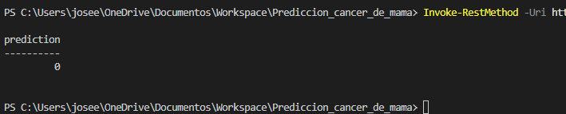
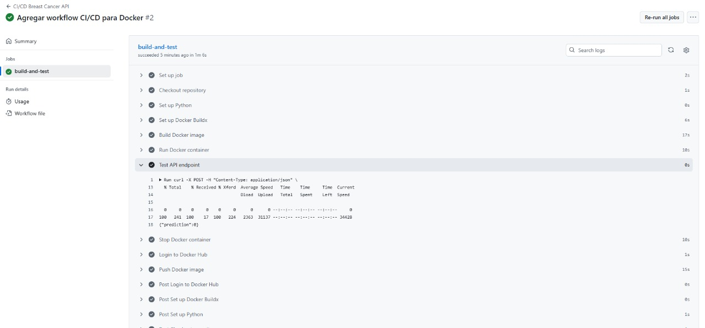

# API de Predicción Breast Cancer

Este proyecto contiene un **modelo de Machine Learning** entrenado con el dataset Breast Cancer (Wisconsin) y una **API REST con Flask** para realizar predicciones. Además, el proyecto está **dockerizado** y cuenta con un workflow de **CI/CD en GitHub Actions** que construye, prueba y publica la imagen en Docker Hub automáticamente.

---

## 1. Descripción del proyecto

- **Modelo Predictivo:** Random Forest entrenado con el dataset Breast Cancer de sklearn.
- **API:**  
  - `GET /` → prueba el estado del servicio  
  - `POST /predict` → recibe un JSON con 30 características y devuelve la predicción (benigno/maligno)
- **Docker:** Contenedor con API y modelo listo para ejecutar en cualquier máquina con Docker.
- **CI/CD:** Workflow en GitHub Actions que construye, prueba y publica la imagen.

---

## 2. Requisitos

- Python 3.10+
- Docker Desktop
- Git
- (Opcional) PowerShell o terminal Bash para pruebas

---

## 3. Clonar el repositorio

```bash
git clone https://github.com/joch89/Prediccion-Cancer-de-mama.git
cd Prediccion-Cancer-de-mama
```

## 4. Ejecutar la API localmente (sin Docker)

```bash
python app.py
```
La API quedará disponible en http://localhost:5000

## 5. Probar la API
El repositorio ya incluye un archivo `entrada.json` con un ejemplo de entrada válido.

> ℹ️ El modelo utiliza **30 parámetros numéricos** extraídos de imágenes de tejido mamario (features calculadas a partir de un estudio de células).  
> Estos parámetros incluyen medidas como radios, texturas, perímetro, área, suavidad, compacidad, simetría y fractalidad, entre otros.  
> En conjunto, permiten al modelo clasificar el tumor como **benigno (0)** o **maligno (1)**.


Opción 1: Usando `curl` (Linux / macOS / Git Bash en Windows)
```bash
curl -X POST -H "Content-Type: application/json" \
-d @entrada.json \
http://localhost:5000/predict
```

Opción 2: Usando PowerShell (Windows)
```bash
Invoke-RestMethod -Uri http://localhost:5000/predict -Method POST -ContentType "application/json" -Body (Get-Content .\entrada.json -Raw)
```  

Ejemplo de salida esperada



**0 → Benigno**  
  El modelo clasifica el caso como **no cancerígeno**.  

## 6. Ejecutar con Docker
1. Construir la imagen:
```bash
docker build -t breast_api .
```

2. Correr el contenedor:
```bash
docker run -d -p 5000:5000 --name breast_api breast_api
```

3. Probar la API usando los comandos de curl o PowerShell mencionados antes.
```bash
Invoke-RestMethod -Uri http://localhost:5000/predict -Method POST -ContentType "application/json" -Body (Get-Content .\entrada.json -Raw)
```

4. Detener el contenedor:
```bash
docker stop breast_api
docker rm breast_api
```

## 7. CI/CD (GitHub Actions)

El workflow **CI/CD Breast Cancer API** se ejecuta automáticamente cada vez que haces push al branch `main`. Este workflow realiza los siguientes pasos:

1. Construye la imagen Docker de la API.
2. Levanta un contenedor temporal y prueba el endpoint `/predict`.
3. Hace login en Docker Hub y publica la imagen (`<tu_usuario_docker>/breast_api:latest`).

Esto permite tener siempre la última versión de la API disponible para cualquier máquina sin necesidad de ejecutar pasos manuales.

### Ejemplo visual del workflow



Con esta automatización, cualquier actualización del código o del modelo se refleja inmediatamente en la imagen de Docker disponible en Docker Hub. Esto asegura consistencia, reproducibilidad y facilita el despliegue de la API en cualquier entorno.

## 8. Próximos pasos

Aunque este repositorio ya incluye un modelo entrenado, una API funcional y un workflow de CI/CD que publica la imagen en Docker Hub, el proyecto puede completarse y escalarse aún más mediante su despliegue en la nube. Los siguientes pasos podrían considerarse para llevar la actividad al nivel profesional:

1. **Despliegue en Azure ML**  
   - Subir el modelo entrenado (`modelo.pkl`) a Azure ML.  
   - Configurar un **Endpoint REST** en Azure para exponer la API en la nube.  
   - Integrar un **Contenedor Docker** con la API directamente en Azure ML.

2. **Automatización y Monitoreo en la nube**  
   - Configurar métricas de uso y latencia mediante **Azure Monitor** o **Application Insights**.  
   - Establecer alertas y trazabilidad de las predicciones del modelo.  

3. **Escalabilidad y seguridad**  
   - Configurar la API para soportar múltiples solicitudes concurrentes.  
   - Asegurar el endpoint con autenticación y cifrado HTTPS.  

Estos pasos permitirán que el servicio de predicción Breast Cancer esté completamente listo para su uso profesional en cualquier entorno cloud, garantizando accesibilidad, trazabilidad y escalabilidad.
